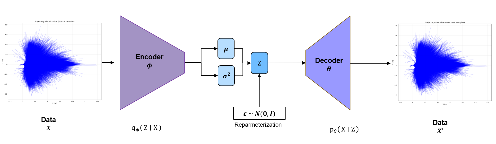
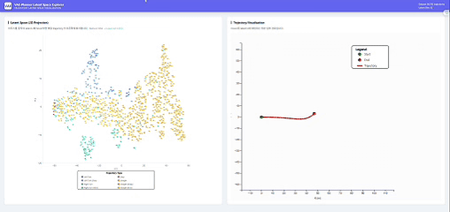

# VAE-Planner

VAE (Variational Autoencoder) based trajectory prediction model for autonomous vehicles

## 📋 Project Overview

VAE-Planner is a deep learning model that predicts future trajectories of autonomous vehicles using Variational Autoencoders. It is trained on 8-second trajectory data from the nuPlan dataset and can generate multiple trajectories for various driving scenarios.

### Key Features

- **VAE-based Uncertainty Modeling**: Multi-modal trajectory prediction through latent variable sampling
- **β-VAE Annealing**: Gradually increases KL divergence weight to prevent posterior collapse
- **Interactive Visualization**: Explore latent space and visualize trajectories through a web-based visualization server
- **nuPlan Dataset Support**: Utilizes large-scale autonomous driving dataset

## 🏗️ Model Architecture



VAE-Planner consists of the following structure:

1. **Encoder**: Encodes 160-dimensional trajectory vectors (80 timesteps × 2 dimensions) into 32-dimensional latent space
   - Architecture: 160 → 512 → 256 → 128 → 32 (μ, logvar)
   
2. **Reparameterization Trick**: Samples latent variable z from μ and logvar
   - z = μ + σ × ε, where ε ~ N(0, I)

3. **Decoder**: Reconstructs 160-dimensional trajectory vectors from 32-dimensional latent z
   - Architecture: 32 → 128 → 256 → 512 → 160

For detailed architecture documentation, see [VAE_ARCHITECTURE.md](VAE_ARCHITECTURE.md).

### Training Results Example



## 📦 Installation

### Requirements

- Python 3.9 or higher
- CUDA-enabled GPU (recommended)
- Node.js 14 or higher (for visualization server)

### Python Package Installation

```bash
# From project root
pip install -r requirements.txt
```

Or install individually:

```bash
pip install torch torchvision torchaudio
pip install numpy scikit-learn pyyaml tqdm matplotlib
pip install wandb tensorboard  # Optional: for training logging
```

### Visualization Server Dependencies

```bash
cd visualization_server
pip install -r requirements.txt
npm install
```

## 📊 Data Preparation

### Extracting Trajectories from nuPlan Dataset

1. Download the nuPlan dataset and set up the paths.

2. Modify `data_process/extract_8s_trajectories.sh` to configure data paths:

```bash
NUPLAN_DATA_PATH="$HOME/99_dataset/01_nuplan/dataset/nuplan-v1.1/splits/trainval"
NUPLAN_MAP_PATH="$HOME/99_dataset/01_nuplan/dataset/maps"
TRAJECTORY_SAVE_PATH="$HOME/99_dataset/01_nuplan/dataset/exp2/trajectories_8s.npz"
NUM_SAMPLES=100000  # Number of samples to extract
```

3. Run the trajectory extraction script:

```bash
cd data_process
chmod +x extract_8s_trajectories.sh
./extract_8s_trajectories.sh
```

The extracted data is saved in `.npz` format, where each sample is a 160-dimensional vector (80 timesteps × 2 dimensions [x, y]).

## 🚀 Usage

### 1. Configure Settings

Open `train/config.yaml` and modify data paths and training settings:

```yaml
data:
  trajectory_data_path: "$HOME/99_dataset/01_nuplan/dataset/exp2/trajectories_8s.npz"
  normalize: true  # Whether to normalize data
  max_samples: 100000  # Maximum number of samples to use

model:
  future_horizon: 80  # Number of future frames (8 seconds × 10Hz)
  future_dim: 2  # [x, y]
  latent_dim: 32  # Latent space dimension
  kl_weight: 0.5  # KL divergence weight
  kl_annealing:
    enabled: true  # Whether to use annealing
    start_weight: 0.01  # Initial KL weight
    end_weight: 0.5  # Final KL weight
    annealing_type: "linear"  # "linear" or "cosine"
    warmup_epochs: 2  # Number of warmup epochs

training:
  batch_size: 32
  num_epochs: 5
  learning_rate: 1e-4
  weight_decay: 1e-5
  gradient_clip: 1.0
```

### 2. Training

```bash
cd train
python train.py --config config.yaml --name vae-planner-training
```

#### Key Options

- `--config`: Configuration file path (default: `config.yaml`)
- `--resume`: Checkpoint path (for resuming training)
- `--name`: Experiment name (default: `vae-planner-training`)
- `--num_workers`: Number of data loading workers (default: 8)
- `--use_wandb`: Whether to use Wandb logging (default: True)

#### Wandb Setup (Optional)

To use Wandb for training logging, you need to set up your API key:

```bash
# Method 1: Login via command (recommended)
wandb login

# Method 2: Set environment variable
export WANDB_API_KEY=your_api_key_here
```

You can find your API key at [https://wandb.ai/settings](https://wandb.ai/settings).

### 3. View Training Results

Training results are saved in `train/train_output/<experiment_name>/<timestamp>/` directory:

- `checkpoints/`: Model checkpoint files (`.pth`)
- `logs/`: TensorBoard log files
- `latent_analysis/`: Latent space analysis results (includes PCA visualization)
- `original_trajectories.npz`: Original trajectory data used for training

View training progress with TensorBoard:

```bash
tensorboard --logdir train/train_output
```

## 🎨 Visualization Server

A web application that allows you to explore the latent space of trained models and visualize trajectories in your browser.

### Build and Run

1. **Build Client** (first time or when client code changes):

```bash
cd visualization_server
./build_client.sh
```

2. **Start Server**:

```bash
./start_server.sh
```

Or:

```bash
python app.py --config ../train/config.yaml --port 5000
```

3. **Access in Browser**:

```
http://localhost:5000
```

The server automatically:
- Finds and uses the latest checkpoint from `train/train_output`
- Loads dataset path from config file
- Serves the integrated React client

### Manual Checkpoint Specification

```bash
python app.py --checkpoint <checkpoint_path> --config ../train/config.yaml --port 5000
```

### Key Features

- **Latent Space Visualization**: Trajectories from the dataset are projected to 2D in latent space (PCA or t-SNE)
- **Interactive Hover**: Moving the mouse in latent space highlights the nearest latent z and displays the corresponding original input trajectory
- **Trajectory Visualization**: Original trajectories are visualized with start point (green), end point (red), and path (red line)

For more details, see [visualization_server/README.md](visualization_server/README.md).

### Deploy to GitHub Pages

You can deploy the visualization server to GitHub Pages for public access. The frontend will be hosted on GitHub Pages, while the backend API needs to be hosted separately (e.g., Render, Railway, or Heroku).

See [GITHUB_PAGES_SETUP.md](GITHUB_PAGES_SETUP.md) for detailed deployment instructions.

## 📁 Project Structure

```
VAE-Planner/
├── data/                          # Data loaders
│   ├── __init__.py
│   └── trajectory_dataset.py      # Trajectory dataset class
├── data_process/                  # Data preprocessing
│   ├── extract_8s_trajectories.py
│   └── extract_8s_trajectories.sh
├── models/                        # Model definitions
│   ├── __init__.py
│   ├── vae.py                    # VAE module (Encoder, Decoder)
│   └── trajectory_predictor.py   # Integrated model
├── train/                         # Training scripts
│   ├── config.yaml               # Training configuration file
│   ├── train.py                  # Training script
│   └── train_output/             # Training results directory
│       └── <experiment_name>/
│           └── <timestamp>/
│               ├── checkpoints/  # Model checkpoints
│               ├── logs/         # TensorBoard logs
│               └── latent_analysis/  # Latent space analysis results
├── utils/                         # Utility functions
│   ├── loss.py                   # Loss functions (MSE, KL Divergence)
│   └── metrics.py                # Evaluation metrics
├── visualization_server/          # Visualization web server
│   ├── app.py                    # Flask backend API server
│   ├── src/                      # React frontend
│   │   ├── App.jsx
│   │   └── components/
│   │       ├── LatentSpacePlot.jsx
│   │       └── TrajectoryCanvas.jsx
│   ├── requirements.txt          # Python dependencies
│   ├── package.json              # Node.js dependencies
│   ├── build_client.sh           # Client build script
│   └── start_server.sh           # Server start script
├── trajectory_visualizations/     # Trajectory visualization results
├── assets/                       # Assets (images, gifs)
│   ├── model_architecture.png
│   └── VAE_results_1.gif
├── requirements.txt              # Main Python dependencies
└── README.md                     # This file
```

## 🔧 Key Features Explained

### β-VAE Annealing

Focuses on reconstruction early in training and gradually increases KL divergence to prevent posterior collapse:

- **Warmup Phase**: Maintains low KL weight for the first N epochs
- **Annealing Phase**: Increases KL weight linearly or using cosine schedule
- Configuration: `model.kl_annealing` section in `config.yaml`

### Data Normalization

Normalizes trajectory data by computing mean and standard deviation of the dataset:

- Normalization parameters are automatically computed or loaded from `trajectory_norm_params_path`
- Normalized data can be saved in `_normalized.npz` format

### Latent Space Analysis

Automatically performs latent space analysis after training:

- Classifies trajectories into stop, left turn, right turn, and straight
- Projects latent space to 2D using PCA
- Visualizes trajectory samples by category

For detailed classification criteria, see [TRAJECTORY_CLASSIFICATION.md](TRAJECTORY_CLASSIFICATION.md).

## 📝 Notes

- Original trajectories used for training are saved in `train_output/<experiment_name>/<timestamp>/original_trajectories.npz`
- All trajectories are normalized to start at (0, 0) (local coordinate system)
- If GPU memory is insufficient, reduce `batch_size` or adjust `num_workers`

## 📄 License

This project is provided for research and educational purposes.

## 🙏 Acknowledgments

- nuPlan Dataset: [nuPlan-devkit](https://github.com/motional/nuplan-devkit)
- Visualization server was created with reference to CVAE-Planner's visualization_server
