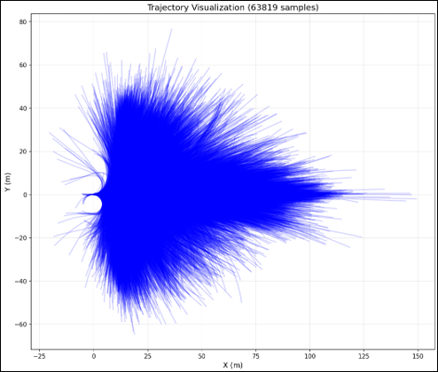
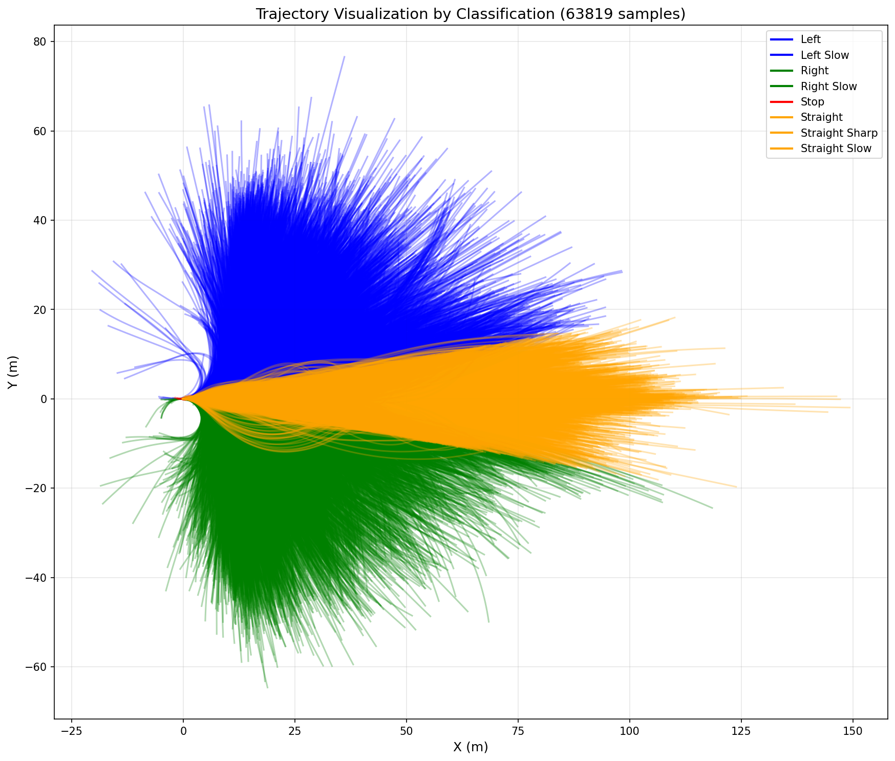
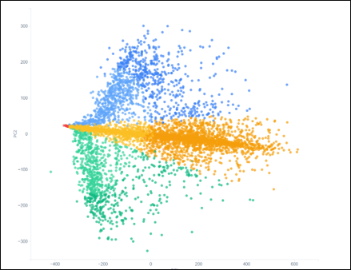
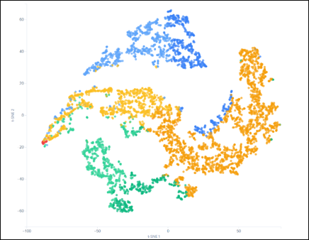

# VAE-generated trajectory

## 📋 Project Overview

VAE-generated trajectory is a deep learning model that predicts future trajectories of autonomous vehicles using Variational Autoencoder. It is trained on 8-second trajectory data extracted from the nuPlan dataset and can generate multiple trajectories for various driving scenarios.


## 🏗️ Model Architecture


VAE-generated trajectory consists of the following structure:

1. **Encoder**: Encodes 160-dimensional trajectory vectors into 32-dimensional latent space
   - Architecture: 160 → 512 → 256 → 128 → 32 (μ, logvar)
   - Includes Batch Normalization and Dropout
   
2. **Reparameterization Trick**: Samples latent variable z from μ and logvar
   - z = μ + σ × ε, where ε ~ N(0, I)

3. **Decoder**: Reconstructs 160-dimensional trajectory vectors from 32-dimensional latent z
   - Architecture: 32 → 128 → 256 → 512 → 160
   - Tanh activation function limits range to [-1, 1] for normalized data

## ✨ Key Features

### VAE-based Uncertainty Modeling

Multiple trajectory prediction is possible through latent variable sampling. By leveraging the probabilistic nature of VAE, various trajectories can be generated for the same input, implementing uncertainty modeling crucial for autonomous driving.

- **Encoder**: Encodes 160-dimensional trajectory vectors into 32-dimensional latent space
- **Reparameterization Trick**: Samples latent variable z from μ and logvar (z = μ + σ × ε)
- **Decoder**: Reconstructs 160-dimensional trajectory vectors from 32-dimensional latent z
- **Multiple Trajectory Generation**: Samples multiple possible trajectories for the same situation

### 8-second Trajectory Dataset

Uses high-quality trajectory data extracted from the nuPlan dataset:

- **Data Format**: 160-dimensional vector (80 timesteps × 2 dimensions [x, y])
- **Temporal Resolution**: 10Hz (0.1 second intervals)
- **Trajectory Length**: 8 seconds future prediction
- **Data Normalization**: Normalizes starting point to (0, 0) using local coordinate system

### React-based Interactive Visualization Server

Provides a web-based visualization tool with Flask backend and React frontend:

- **Real-time Latent Space Exploration**: 2D visualization through PCA, t-SNE, UMAP
- **Interactive Trajectory Generation**: Click on latent space to generate new trajectories
- **Browse Mode**: Explore and analyze existing training data
- **Generate Mode**: Generate trajectories from arbitrary latent points
- **Trajectory Classification Visualization**: Color-coded distinction (stop, straight, left turn, right turn, etc.)
- **Real-time Trajectory Information**: View 2D coordinates and latent vectors of generated trajectories

### Latent Space Analysis and Visualization

Automatically performs latent space analysis after training:

- **Trajectory Classification**: Automatically classifies into 8 categories (stop, left turn, right turn, straight, etc.)
- **PCA-based Visualization**: Projects 32-dimensional latent space to 2D
- **t-SNE/UMAP Clustering**: Identifies cluster structure of similar trajectory patterns
- **Category-specific Sample Visualization**: View representative trajectories for each classification

### nuPlan Dataset Support

Utilizes nuPlan, a large-scale autonomous driving dataset:

- **Large-scale Data**: Hundreds of thousands of real driving scenarios
- **Diverse Road Environments**: Includes various situations such as highways, urban areas, intersections
- **Real Vehicle Data**: Data collected from actual autonomous vehicles

## 📊 Training Results

### Training Results Example
It can be confirmed that the characteristics of each trajectory are well disentangled in the latent space.
You can check the trajectory corresponding to each sampled z using the mouse hover function on the web.


### Input Data Visualization



Visualization results of 8-second trajectory data extracted from the nuPlan dataset.
Only one sample per scenario type was randomly extracted to generate trajectories.

### Trajectory Classification Criteria

Trajectories are classified according to the following criteria:

| Classification | Condition | Description |
|------|------|------|
| **Stop** | Trajectory length < 2.0m | Straight-line distance between start and end points is less than 2m |
| **Straight** | -10° ≤ angle ≤ 10° | Start-end angle is nearly straight |
| **Straight(sharp)** | Straight + sharp curve | Straight direction but average curvature > 0.15 rad or max curvature > 0.3 rad |
| **Straight(slow)** | Straight + slow speed | Straight direction but average speed < 5 m/s |
| **Left Turn** | angle > 10° | Start-end angle is leftward |
| **Left Turn(Slow)** | Left turn + slow speed | Left turn direction but average speed < 5 m/s |
| **Right Turn** | angle < -10° | Start-end angle is rightward |
| **Right Turn(Slow)** | Right turn + slow speed | Right turn direction but average speed < 5 m/s |




Visualization of all trajectories in the dataset, color-coded according to the classification criteria above.

### PCA-based Latent Space Visualization



Results of projecting 32-dimensional latent space to 2D using PCA (Principal Component Analysis). Each color represents trajectory classification.

### t-SNE-based Latent Space Visualization



Results of visualizing cluster structure in latent space using t-SNE (t-Distributed Stochastic Neighbor Embedding). Similar trajectory patterns can be seen clustering together.


## 📦 Installation

### Requirements

- Python 3.9 or higher
- CUDA-enabled GPU (recommended)
- Node.js 14 or higher (for visualization server)

### Python Package Installation

```bash
# From project root
pip install -r requirements.txt
```

Or install individually:

```bash
pip install torch torchvision torchaudio
pip install numpy scikit-learn pyyaml tqdm matplotlib
pip install wandb tensorboard  # Optional: for training logging
```

### nuPlan Dependencies

This project uses the **nuPlan** dataset and requires the nuPlan devkit for data extraction. The `data/extract_8s_trajectories.py` script depends on the nuPlan library.

**Installation Method:**

1. Follow the official nuPlan installation guide: [nuPlan-devkit Documentation](https://github.com/motional/nuplan-devkit)

2. Basic installation steps:
   ```bash
   # Clone nuPlan devkit
   git clone https://github.com/motional/nuplan-devkit.git
   cd nuplan-devkit
   
   # Install dependencies
   pip install -e .
   ```

3. For detailed installation guide (including Docker setup and dataset download), refer to:
   - [nuPlan-devkit README](https://github.com/motional/nuplan-devkit#installation)
   - [nuPlan Documentation](https://nuplan-devkit.readthedocs.io/)

**Note**: The nuPlan devkit requires specific system dependencies and may need additional setup. Please refer to the official documentation.

### Visualization Server Dependencies

```bash
cd visualization_server
pip install -r requirements.txt
npm install
```

**Optional**: UMAP visualization support:
```bash
pip install umap-learn
```

## 📊 Data Preparation

### Extracting Trajectories from nuPlan Dataset

1. Download the nuPlan dataset and set the path.

2. Modify `data/extract_8s_trajectories.sh` to set the data path:

```bash
# Set path via environment variables (default values can be used)
export NUPLAN_DATA_PATH="$HOME/99_dataset/01_nuplan/dataset/nuplan-v1.1/splits/trainval"
export NUPLAN_MAP_PATH="$HOME/99_dataset/01_nuplan/dataset/maps"
export TRAJECTORY_SAVE_PATH="$HOME/99_dataset/01_nuplan/dataset/vae/trajectories_8s.npz"
export NUM_SAMPLES=100000  # Number of samples to extract
```

Or modify directly in the script:

```bash
NUPLAN_DATA_PATH="${NUPLAN_DATA_PATH:-$HOME/99_dataset/01_nuplan/dataset/nuplan-v1.1/splits/trainval}"
NUPLAN_MAP_PATH="${NUPLAN_MAP_PATH:-$HOME/99_dataset/01_nuplan/dataset/maps}"
TRAJECTORY_SAVE_PATH="${TRAJECTORY_SAVE_PATH:-$HOME/99_dataset/01_nuplan/dataset/vae/trajectories_8s.npz}"
NUM_SAMPLES=100000
```

3. Run the trajectory extraction script:

```bash
cd data
chmod +x extract_8s_trajectories.sh
./extract_8s_trajectories.sh
```

Extracted data is saved in `.npz` format, with each sample being a 160-dimensional vector (80 timesteps × 2 dimensions [x, y]).

### Data Visualization (Post-processing Verification)

You can visualize the extracted data to verify:

```bash
cd data
./visualize_trajectories.sh
```

Or run directly with Python:

```bash
python data/visualize_trajectories.py \
    --data_path "$HOME/99_dataset/01_nuplan/dataset/vae/trajectories_8s.npz" \
    --num_samples 100000 \
    --save_dir ./trajectory_visualizations
```

### Planning Vocabulary Generation (Optional)

You can generate Planning Vocabulary using K-means clustering:

```bash
cd data
./create_planning_vocabulary.sh
```

Or run directly with Python:

```bash
python data/create_planning_vocabulary.py \
    --data_path "$HOME/99_dataset/01_nuplan/dataset/vae/trajectories_8s.npz" \
    --k 5 \
    --num_samples 100000 \
    --save_dir ./planning_vocabulary
```

## 🚀 Usage

### 1. Configuration File Setup

Open `train/config.yaml` and modify data paths and training settings:

```yaml
data:
  trajectory_data_path: "$HOME/99_dataset/01_nuplan/dataset/vae/trajectories_8s.npz"
  trajectory_norm_params_path: "$HOME/99_dataset/01_nuplan/dataset/vae/trajectories_8s_norm_params.json"
  normalize: true  # Whether to normalize data
  max_samples: 100000  # Maximum number of samples to use

model:
  future_horizon: 80  # Number of future frames (8 seconds × 10Hz = 80)
  future_dim: 2  # [x, y]
  latent_dim: 32  # Latent space dimension
  kl_weight: 0.0001  # KL Divergence Loss weight

training:
  batch_size: 32
  num_epochs: 500
  learning_rate: 1.5e-4
  weight_decay: 1e-5
  gradient_clip: 1.0
  lr_scheduler:
    enabled: true
    mode: "min"
    factor: 0.7
    patience: 8
    min_lr: 1e-7
```

### 2. Training

```bash
cd train
python train.py --config config.yaml --name VAE-generated trajectory-training
```

#### Main Options

- `--config`: Configuration file path (default: `config.yaml`)
- `--resume`: Checkpoint path (for resuming training)
- `--name`: Experiment name (default: `VAE-generated trajectory-training`)
- `--num_workers`: Number of data loading workers (default: 8)
- `--use_wandb`: Whether to use Wandb logging (default: True)

### 3. Checking Training Results

Training results are saved in `train/train_output/<experiment_name>/<timestamp>/` directory:

- `checkpoints/`: Model checkpoint files (`.pth`)
- `logs/`: TensorBoard log files
- `latent_analysis/`: Latent space analysis results (including PCA visualization)
- `original_trajectories.npz`: Original trajectory data used for training

Check training progress with TensorBoard:

```bash
tensorboard --logdir train/train_output
```

## 🎨 Visualization Server

A web application for exploring the latent space of trained models and visualizing trajectories.

### Build and Run

1. **Build Client** (once initially or when client code changes):

```bash
cd visualization_server
./build_client.sh
```

2. **Start Server**:

```bash
./start_server.sh
```

Or:

```bash
python app.py --config ../train/config.yaml --port 5000
```

3. **Access in Browser**:

```
http://localhost:5000
```

The server automatically:
- Finds and uses the latest checkpoint from `train/train_output`
- Reads and loads dataset path from config file
- Serves integrated React client
- Limits to 5,000 samples by default for performance

### Manual Checkpoint Specification

```bash
python app.py --checkpoint <checkpoint_path> --config ../train/config.yaml --port 5000
```

### User Guide

1. **Select Projection Method**: Choose PCA, t-SNE, or UMAP from the header
   - PCA: Optimal for Generate mode (accurate inverse transformation)
   - t-SNE/UMAP: Better for cluster visualization in Browse mode

2. **Browse Mode**:
   - Move mouse over latent space to view existing trajectories
   - Trajectories are color-coded by type (stop, left turn, right turn, straight)
   - Click data points to fix trajectory view

3. **Generate Mode**:
   - Click anywhere on latent space to generate new trajectories
   - View 2D coordinates and 32-dimensional latent z vector
   - Generated trajectories are marked with ✨
   - **Note**: PCA provides accurate inverse transformation, while t-SNE/UMAP uses interpolation

4. **Trajectory Information**:
   - Generated trajectories display 2D projection coordinates and full latent z vector
   - Trajectory classification (stop/left turn/right turn/straight) is automatically displayed

For more details, refer to [visualization_server/README.md](visualization_server/README.md).

### GitHub Pages Deployment

The visualization server can be deployed to GitHub Pages for public access. The frontend is hosted on GitHub Pages, while the backend API needs to be hosted separately (e.g., Render, Railway, Heroku).

For detailed deployment guide, refer to [.github/workflows/README.md](.github/workflows/README.md).

## 📁 Project Structure

```
VAE-generated trajectory/
├── data/                          # Data preprocessing and loaders
│   ├── __init__.py
│   ├── trajectory_dataset.py      # Trajectory dataset class
│   ├── extract_8s_trajectories.py  # Extract 8-second trajectories from nuPlan
│   ├── extract_8s_trajectories.sh
│   ├── visualize_trajectories.py  # Data visualization (post-processing verification)
│   ├── visualize_trajectories.sh
│   ├── create_planning_vocabulary.py  # Planning Vocabulary generation
│   └── create_planning_vocabulary.sh
├── models/                        # Model definitions
│   ├── __init__.py
│   ├── vae.py                    # VAE module (Encoder, Decoder)
│   ├── trajectory_predictor.py   # Integrated model
│   ├── loss.py                   # Loss functions
│   └── metrics.py                # Evaluation metrics
├── train/                         # Training scripts
│   ├── config.yaml               # Training configuration file
│   ├── train.py                  # Training script
│   └── train_output/             # Training results directory
│       └── <experiment_name>/
│           └── <timestamp>/
│               ├── checkpoints/  # Model checkpoints
│               ├── logs/         # TensorBoard logs
│               └── latent_analysis/  # Latent space analysis results
├── visualization_server/          # Visualization web server
│   ├── app.py                    # Flask backend API server
│   ├── src/                      # React frontend
│   │   ├── App.jsx
│   │   └── components/
│   │       ├── LatentSpacePlot.jsx
│   │       └── TrajectoryCanvas.jsx
│   ├── requirements.txt          # Python dependencies
│   ├── package.json              # Node.js dependencies
│   ├── build_client.sh           # Client build script
│   └── start_server.sh           # Server start script
├── assets/                       # Assets (images, gif)
│   ├── model_architecture.png
│   ├── VAE_results_1.gif
│   ├── input_data.png            # Input data visualization
│   ├── pca.png                   # PCA-based latent space visualization
│   └── tsne.png                  # t-SNE-based latent space visualization
├── requirements.txt              # Main Python dependencies
└── README.md                     # This file
```

## 🔧 Technical Details

### Data Normalization

Trajectory data is normalized by calculating the mean and standard deviation of the dataset:

- Normalization parameters are automatically calculated or loaded from `trajectory_norm_params_path`
- Normalized data can be saved in `_normalized.npz` format
- All trajectories are normalized with starting point at (0, 0) (local coordinate system)

## 📄 License

This project is provided for research and educational purposes.

## 🙏 Acknowledgments

- nuPlan Dataset: [nuPlan-devkit](https://github.com/motional/nuplan-devkit)
